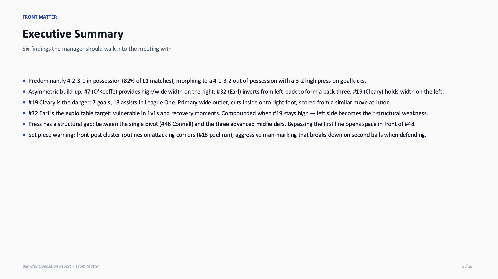
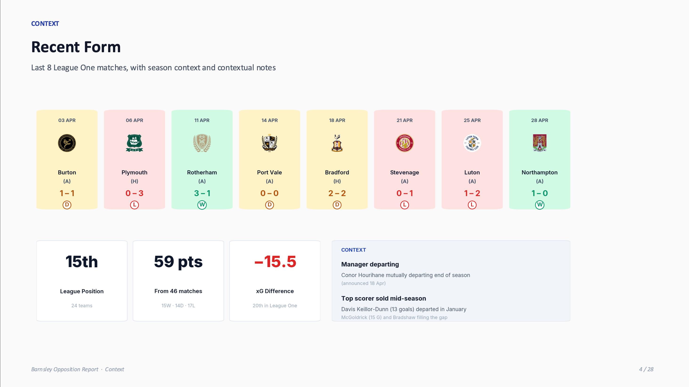
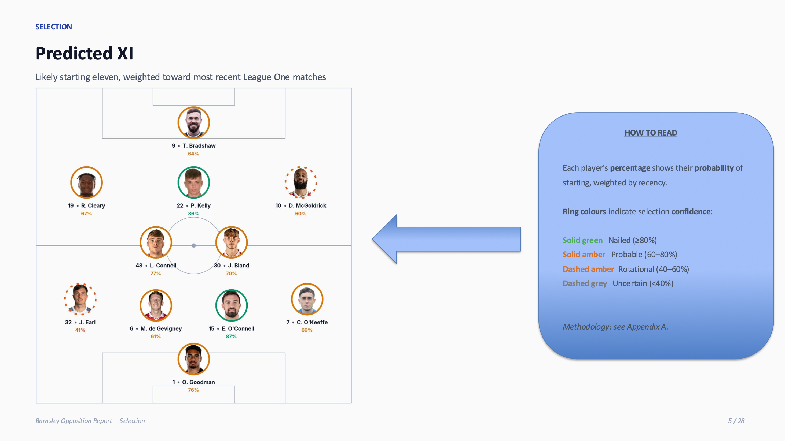
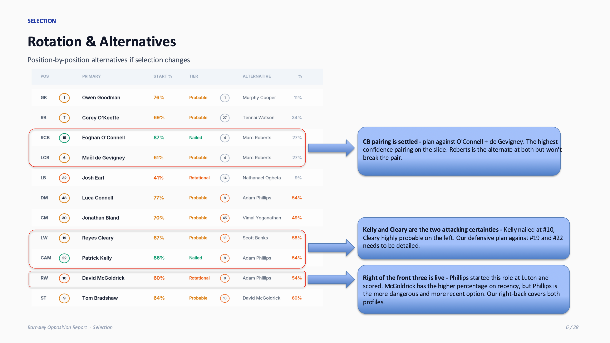
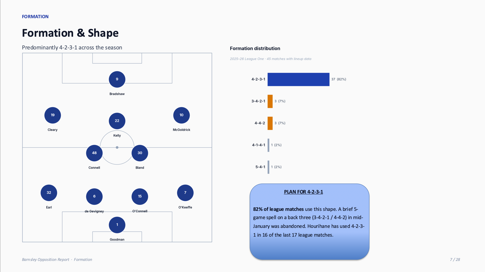
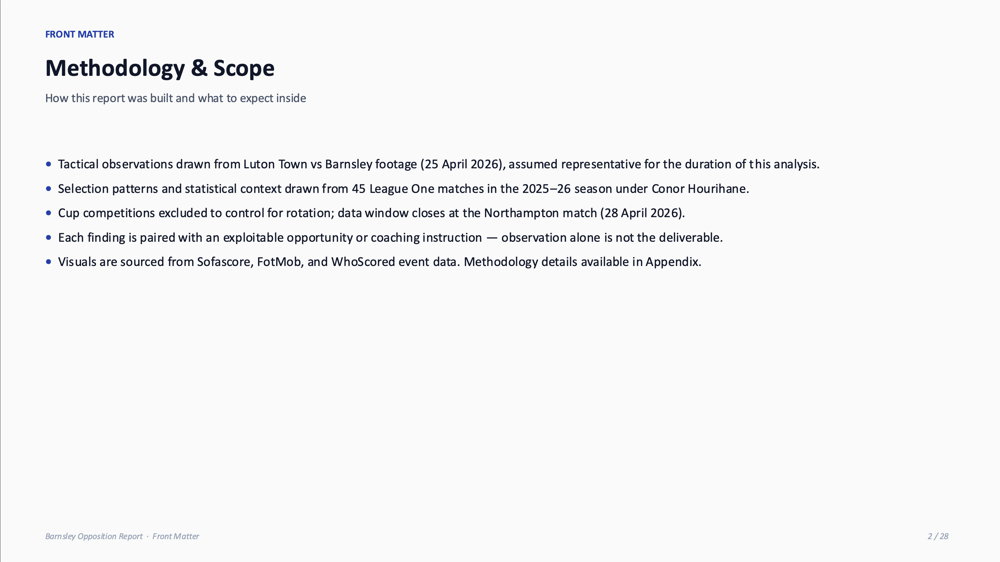

A pre-match opposition report on Barnsley, covering formation tendencies, selection patterns, recent form, and tactical structure under Conor Hourihane.

## The Full Analysis

The slides below are the opening section of a complete 28-page opposition report.

[Read the full report (PDF) →](Barnsley_Opposition_Report.pdf){target="_blank"}

**Telestrated clips presentation and supporting materials** — a slide deck with annotated video clips accompanies the report. Because the files are large, they're hosted on Google Drive.

[Browse all materials (Google Drive) →](https://drive.google.com/drive/folders/1ZJnNGp9AiKq65W8eLW-F62P7O-LjriVh){target="_blank"}

## Executive Summary

{.column-page}

## Recent Form

{.column-page}

## Predicted XI

{.column-page}

## Rotation & Alternatives

{.column-page}

## Formation & Shape

{.column-page}

## Methodology & Scope

{.column-page}
