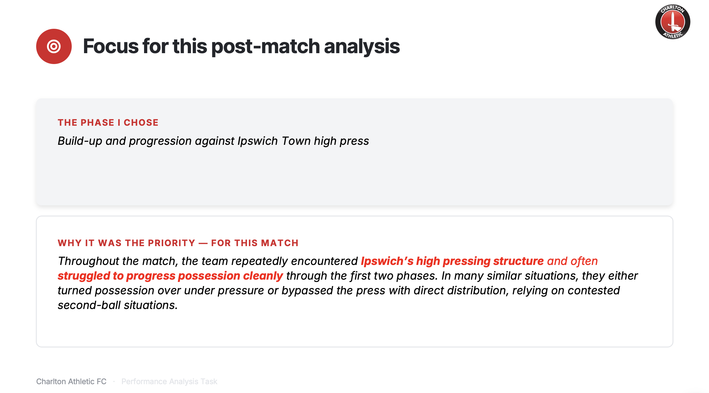
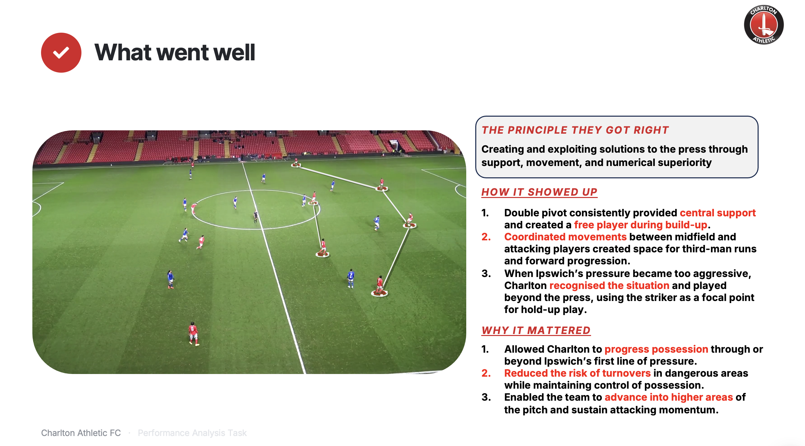
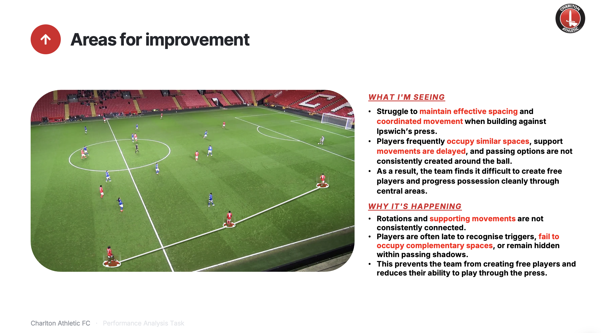
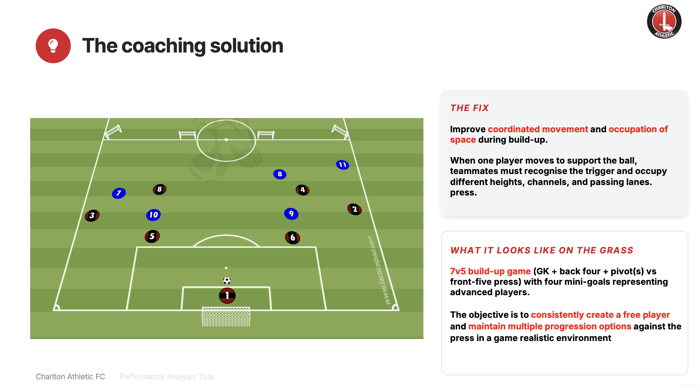
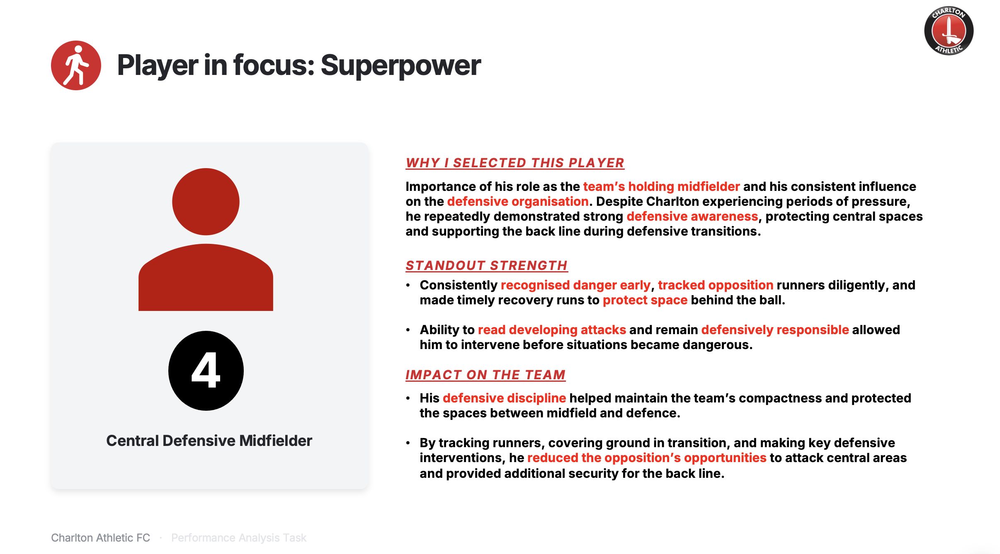

A post-match analysis task completed as part of the interview process for Charlton Athletic's academy, which led to a placement with the club for the 2026/27 season. Given full match footage of a U21 fixture against Ipswich Town, the brief was to identify an aspect of the team's play that fell short, analyse it, and propose a solution — I focused on build-up from the back against Ipswich's high press. The task also required identifying one player who stood out. Clips were tagged and collected in Hudl Sportscode, with telestrations produced in Once Sport.

## The Full Analysis

The slides below are a summary. The full presentation includes telestrated video clips and is best viewed by downloading it, as the file is large.

[Browse the full presentation (Google Drive) →](https://drive.google.com/drive/folders/1NlARtzHvWlZaOVIuy73aKnbDP7MX1AVH){target="_blank"}

## Focus

{.column-page}

## What Went Well

{.column-page}

## Areas for Improvement

{.column-page}

## The Coaching Solution

{.column-page}

## Player in Focus

{.column-page}
